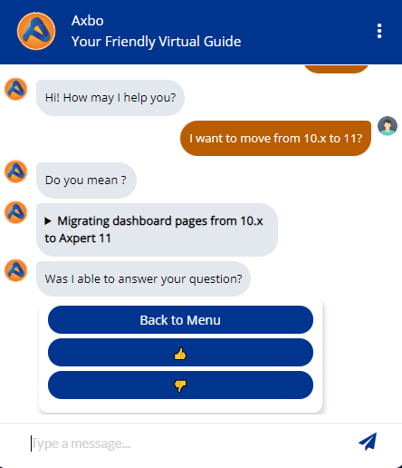
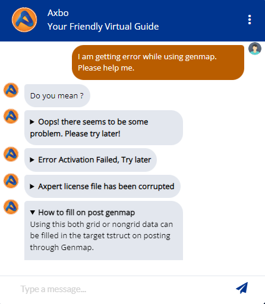
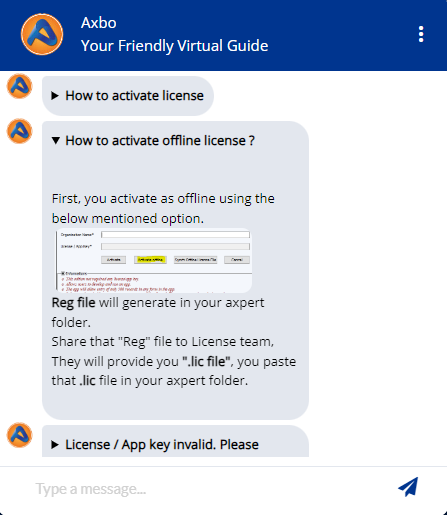

# AI-Powered-IT-Helpdesk-Chatbot-Showcase
Showcasing an AI-Powered IT Helpdesk Chatbot built with RASA. It automates IT support, delivering quick responses to user queries. Due to confidentiality, the code is not shared, but screenshots highlight its features.

# Axpert License Management System

This system streamlines the process of issuing, renewing, modifying, reactivating, and tracking Axpert licenses. It also provides an FAQ section, user-specific query handling, and a resource download section, enhancing user support and operational efficiency.

## Features

### 1. Issue New Axpert License
- Users can submit a new license request form, providing details such as:
  - **Customer Name**
  - **Partner Name**
  - **Email**
  - **Number of Users & Developers**
  - **Remarks**
  - **License Type & Version Preferences**
- The system confirms submission and securely stores user details in a PostgreSQL database.
- Upon approval, the license issuing team sends the license via email.

### 2. Renew Axpert License
- Users can request license renewal by submitting their **License Number**.
- The system verifies the current license status and expiration date.
- User information is stored securely in a PostgreSQL database, enabling the renewal team to process renewals efficiently.

### 3. Modify Axpert License
- Users can request modifications to their existing license, such as adding users or developers.
- The form requires:
  - **Current Number of Users**
  - **Number of Users to Add**
- Details are stored in the database, and requests undergo an approval process before the license is updated.

### 4. Reactivate Axpert License
- Users can initiate reactivation of a deactivated license by providing:
  - **MAC ID**
  - **License Number**
- The system verifies the user's identity and license details before reactivation.

### 5. Track License Details
- Users can view detailed information about their Axpert license, including:
  - **Username**
  - **License Issue & Expiration Dates**
  - **License Types**
  - **Version Details**
  
### 6. Frequently Asked Questions (FAQs)
- FAQs are categorized into seven different categories for easy navigation.
- Users can search the FAQ database using keywords with fuzzy matching.
- The system displays relevant questions and answers based on the search query.

### 7. New Chat - User-Specific Questions
- The system uses a BERT-base model to analyze semantic similarity between user queries and prestored FAQ database entries.
- It calculates similarity scores and retrieves responses such as tutorial videos or text-based explanations based on the highest similarity score.

### 8. Resource Download Section
- The system categorizes resources, such as:
  - **Setup Kits**
  - **Patch Releases**
  - **Axpert Binaries** for different software versions
- Users can navigate to a specific category to access relevant download links.

---

This system is designed to enhance user experience by providing quick access to essential license management features, support resources, and detailed information retrieval.

## Screenshots

### Chatbot Interaction
Here are some outputs from the chatbot showcasing its capabilities:

| License Request Form | Track License Details |
| --- | --- |
|    License Request Form |    Track License Details |

| Modify License | Reactivate License |
| --- | --- |
|    Modify License |    Reactivate License |

| New License Confirmation | Renew License Confirmation |
| --- | --- |
|    New License Confirmation |    Renew License Confirmation |

| New Chat | New Chat |
| --- | --- |
|    New Chat |    New Chat |

| New Chat | FAQs Menu |
| --- | --- |
|    New Chat |    FAQs Menu |

| Common Axpert FAQs Sub Menu | Limit Exceeded FAQs Sub Menu |
| --- | --- |
|    Common Axpert FAQs Sub Menu |    Limit Exceeded FAQs Sub Menu |

| FAQs Answers - “How to ?” | Watch Tutorial Videos |
| --- | --- |
|    FAQs Answers - “How to ?” |    Watch Tutorial Videos |

| Watch Tutorial Videos | Download Resources Sub Menu |
| --- | --- |
|    Watch Tutorial Videos |    Download Resources Sub Menu |

| Download Setup Kits | Download Axpert Binaries |
| --- | --- |
|    Download Setup Kits |    Download Axpert Binaries |

